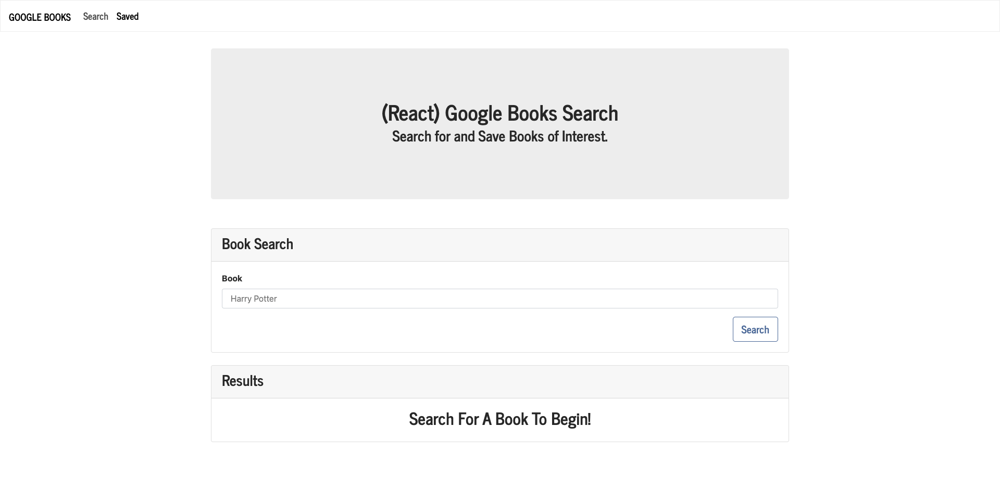

# Google-Books-Search

## Table of Contents

- [Description](#description)
- [Installation](#install)
- [Usage](#usage)
- [Licences](#licences)
- [Questions](#questions)

## Description

MERN Stack application that allows the user to display and save books based on searching with Google Books API.

## Install

- Git Clone https://github.com/chaseyb/Google-Books-Search
- `npm install`
- `npm start`
- Enjoy on http://localhost:3000/

## Usage

When using this web application the user will be able to Search, View, and saved their favorite books from Google Books API.

## Licences

## Heroku Demo

[Heroku link](https://google-books-search-5000.herokuapp.com// "Heroku Link")

## Questions?

- [Chaseyb](https://github.com/Chaseyb)
- <Chase.b.johnson@gmail.com>

  
